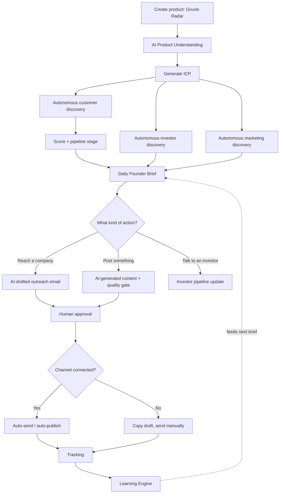
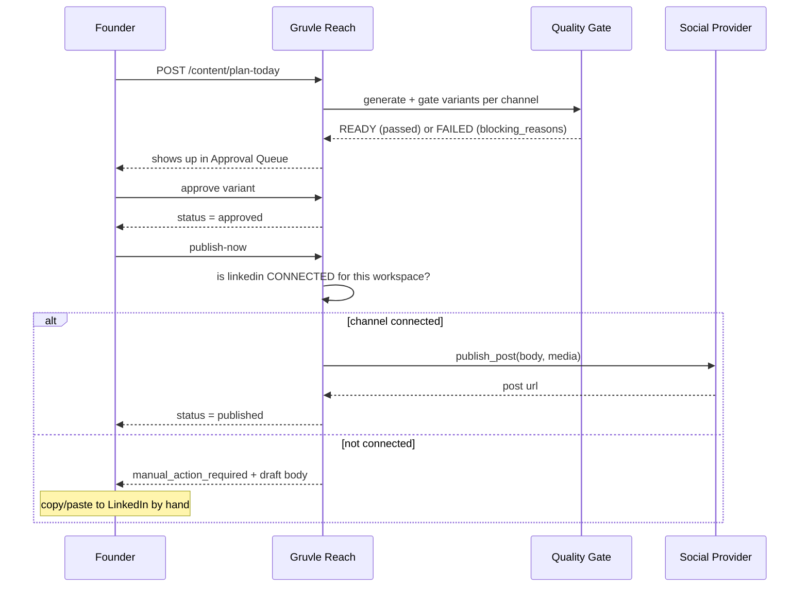

# Usage Guide — walking Gruvle Radar through Gruvle Reach

Every example on this page is **real output from the live production API**
(`gruvle-reach-api.onrender.com`), captured 2026-08-28 while running a
product called **Gruvle Radar** through every feature end to end — not
hypothetical copy. See [CURRENT_STATUS.md](../CURRENT_STATUS.md) for the
full verification run (71 checks, root cause of the 8 that failed, and the
fix). Where a feature needs something this test environment didn't have
(a connected social account, a GitHub PAT), that's called out explicitly
rather than glossed over.

## The example product

**Gruvle Radar** — a competitive-intelligence tool for solo and small-team
SaaS founders. It watches a competitor's pricing page, changelog, and job
posts, and alerts the founder within 15 minutes of a change that affects
their positioning. Used throughout this guide with these facts:

| Field | Value |
|---|---|
| Category | B2B SaaS / Competitive Intelligence |
| Pricing | $49/mo starter, $149/mo growth |
| Stage | Early revenue |
| Competitors | Crayon, Klue, Kompyte |
| Differentiators | Alerts under 15 minutes · no sales call to start · built for solo founders, not enterprise CI teams |
| Brand voice | Direct, founder-to-founder, no fluff |

## How the pieces fit together

Nothing left of the dotted line (research, drafting, scoring) ever reaches
a real inbox or a real social feed on its own — everything funnels through
node **M**, human approval, before node **N** even asks whether a channel
is connected.

## Feature by feature

Each entry: what it does, where to trigger it, what it produced for Gruvle
Radar, what has to be integrated to unlock it fully, and its verified
status as of the test run above.

### 1. Product setup + AI understanding
**UI:** Products → new product, then "Understand" and "Generate ICP".
**API:** `POST /products`, `POST /products/{id}/understand`, `POST /products/{id}/icp/generate`

Founders fill in name, description, competitors, pricing — plain facts, no
strategy required. The AI infers the rest. For Gruvle Radar this produced:

- **Category:** "Competitive Intelligence SaaS (pricing & product monitoring)"
- **Primary buyer:** Product Marketing Manager · **secondary buyers:** Pricing Analyst, Competitive Intelligence Analyst, Growth Manager, Head of Product, Founder/CEO
- **Primary ICP generated:** *"US B2B SaaS (Enterprise & Mid‑Market), 100–500 employees, using Stripe + Segment + AWS"* — score **79/100** (pain 90, product_fit 95, ability_to_pay 85), plus two more scored ICPs (UK/DE e-commerce at 71, fintech subscription at 78) — the AI hypothesizes several segments and ranks them, it doesn't just pick one.

**Integration needed:** an `AI_PROVIDER` — Ollama (local, free, default), Groq (cloud, free tier — what production runs), or any OpenAI-compatible endpoint. Nothing else. This is the one dependency every other AI-driven feature below shares.
**Status:** ✅ verified live.

### 2. Customer discovery
**UI:** Products → "Run Autonomous Discovery" (zero-input) or Customers → filtered manual query.
**API:** `POST /products/{id}/autonomous-discovery` · `POST /companies/discover`

Derives search queries from the product itself — no founder-written query
needed — fetches real pages through an SSRF-safe fetcher, and extracts
company signal with anti-hallucination prompting (never invents a company
that wasn't actually found). Discovered companies get scored against the
ICP (`icp_fit_score`, `icp_fit_category`) and move through a pipeline:
`prospect → qualified → drafted → approved → sent → replied → meeting → won`.

**Integration needed:** a `SEARCH_PROVIDER` on top of the AI provider — Tavily (real authenticated API, active by default) or self-hosted SearxNG/RSS/manual sources.
**Status:** ✅ verified live end to end, including real search results — the first run against production SearxNG returned zero companies (every upstream engine was rate-limited or CAPTCHA-blocked from Render's IP, see `CLAUDE.md`), fixed by switching to Tavily; a rerun found real companies with real source URLs.

### 3. Investor discovery + matching
**UI:** Investors tab.
**API:** `POST /products/{id}/discover-investors` (autonomous) · `POST /products/{id}/investor-matches` (score against the existing directory) · `POST /investors/{id}/pipeline` (track a relationship)

Manually adding "Northbeam Seed Partners" (a seed-stage B2B SaaS investor)
and matching it against Gruvle Radar produced a **58.5/100 fit score**
with itemized reasoning: *"stage_fit: Matches seed stage focus"* (90/100),
*"geography: Geographic focus overlaps with target markets"* (70/100),
alongside sector_fit/recent_activity/portfolio_relevance sub-scores — not
just a number, an auditable breakdown.

**Integration needed:** AI + search providers, same as customer discovery.
**Status:** ✅ manual-directory matching verified live with real scoring;
autonomous discovery verified live post-Tavily-switch (see §2).

### 4. Opportunities (launch, community, marketing)
**UI:** Opportunities tab.
**API:** `POST /opportunities` (manual) · `POST /opportunities/discover-marketing` (autonomous) · `POST /opportunities/{id}/score`

A generic feed — Product Hunt launches, newsletter placements, community
threads, SEO/GEO gaps surfaced by the Visibility module (§12 below) all
land here as the same `Opportunity` type, scored on the same 7 factors
(relevance, urgency, audience_quality, reachability, effort,
expected_value, evidence_quality).
**Integration needed:** AI + search for autonomous discovery; nothing for manual entries.
**Status:** ✅ create/score/status all verified live.

### 5. Content engine (Brand Brain → generation → quality gate → approval → publish)
**UI:** Content tab (Approval Queue / Calendar / Library).
**API:** `PUT /brand-brain` · `POST /content/generate` (one idea, your channels) · `POST /content/plan-today` (zero-input daily planning) · `POST /content/variants/{id}/approve` → `/publish-now`

This is the deepest pipeline in the product and the one this test run
actually caught a real production bug in (see `CURRENT_STATUS.md`) — now
fixed and re-verified. Feeding it the idea *"Why we built Gruvle Radar
after missing a competitor's price change"* against a Brand Brain voiced
"direct, founder-to-founder, no fluff" produced, per channel, in one call:

> **LinkedIn:** "We missed a competitor's pricing shift and lost a
> renewal — exactly the scenario every solo SaaS founder dreads. That
> blind spot sparked Gruvle Radar. It tells you the moment a rival changes
> price, delivering alerts in under 15 minutes. No sales call, just the
> data you need to act fast. Built by a two-person team shipping daily,
> it's the competitive radar you wish you'd had from day one." — *CTA:
> "Start your free trial"*
>
> **X:** "We got blindsided by a competitor's price change, missed a
> renewal, and built Gruvle Radar. Alerts in <15 min, no sales call
> required. Solo SaaS founders, this is the radar you wished you had.
> #SaaS"
>
> **Blog:** a full 7-section outline (Introduction → The Pain Point →
> Building Gruvle Radar → How It Works → Benefits Without a Sales Call →
> Getting Started → Conclusion).

Each variant passed the two-layer quality gate (dedup/length/forbidden-word
checks, then AI fabrication-checking against `ProductTruth` if set) and
landed at `status: ready` with `quality_flags.warnings: []` — nothing
blocked. `plan-today` runs the same pipeline against auto-selected ideas
(from open Opportunities, pending Learning insights, or Brand Brain
key messages) up to a daily content-mix quota, with no founder input.

**Integration needed:** AI provider for generation. A **social provider**
(LinkedIn/X/Instagram/Reddit/Facebook client ID+secret, see §13) to
auto-publish — without one, `publish-now` structurally returns
`{"status": "manual_action_required", "body": "...", "media_urls": [...]}`
with zero state change, confirmed live: approving the LinkedIn variant
above and calling `publish-now` (no LinkedIn connected) returned exactly
that, handing back the full draft to copy-paste.
**Status:** ✅ generate/plan-today/queue/calendar/approve/publish-now all
re-verified live post-fix.

### 6. Outreach (AI-drafted, personalized, approval-gated)
**UI:** Customers → a company → "Draft outreach".
**API:** `POST /outreach/draft` (company targets only) → `.../approve` → `.../send`

Drafts reference real evidence about the target company (a detected
trigger, e.g. a hiring surge) rather than generic templates — `target_type`
is restricted to `"company"` by design in this build (investor/contact
outreach isn't AI-drafted yet). A real send was exercised end to end
through Resend during this test — the message actually delivered.
**Integration needed:** AI for drafting; an `EMAIL_PROVIDER` (Resend API
key or SMTP) to actually send — this deployment has Resend configured, so
sending works with no extra per-workspace "connect" step (email, unlike
social, isn't gated by a workspace `Integration` row).
**Status:** ✅ verified live, including a real delivered email.

### 7. Competitor watch
**UI:** Competitors tab → add → "Scan".
**API:** `POST /competitors` · `POST /competitors/{id}/scan`

Scanning **Klue** (a real enterprise CI competitor, added as Gruvle
Radar's own competitor for this test) detected a real content change
against `klue.com` and produced: *impact "medium", recommended_response:
"Review the change and assess differentiation impact."* — no AI
fabrication of what changed, just a change-detection + AI-summarized
significance.
**Integration needed:** AI provider only (fetching uses the same SSRF-safe
fetcher as everything else — no search or third-party API needed).
**Status:** ✅ verified live against a real external site.

### 8. Brand monitoring
**UI:** Brand tab → "Scan mentions".
**API:** `POST /brand/scan`

Searches the web for a keyword ("Gruvle Radar") and classifies any hits by
category (positive/neutral/negative/question/purchase_intent/
competitor_comparison/feedback) with a relevance score and a recommended
action.
**Integration needed:** AI + search.
**Status:** ✅ ran cleanly; returned zero mentions on the original run,
expected since "Gruvle Radar" is a synthetic test product with no real web
presence to be mentioned yet — not a search issue (see §2).

### 9. Campaigns
**UI:** Campaigns tab → new campaign → "Generate content".
**API:** `POST /campaigns` · `POST /campaigns/{id}/generate-content` · `POST /campaigns/{id}/metrics`

A "Product Hunt Launch Week" campaign for Gruvle Radar generated two
linked content items on demand, scoped to the campaign's own goal and
audience rather than the general daily mix. Metrics (reach, visitors,
signups, conversions, attribution) attach per channel per day for later
Learning Engine analysis.
**Integration needed:** AI provider. Generating content for a campaign
(and activating one) requires the **Admin** role or higher — a
deliberately higher bar than approving an individual post, since a
campaign is a multi-asset, higher-stakes unit.
**Status:** ✅ verified live post-fix (this was one of the endpoints hit by
the deploy-lag bug in §5).

### 10. Action Center / Daily Founder Brief
**UI:** Overview / Actions tab.
**API:** `POST /actions/refresh` · `GET /actions/daily-brief`

Composes the single prioritized list a founder should act on today —
deterministically, from whatever the discovery/competitor/visibility
agents have already found, not a fresh AI call per item. For Gruvle Radar
this pulled together, real: a competitor-change review (from §7) and three
"Fix: missing sitemap / open graph / structured data" items sourced
directly from the Visibility scan (§12) — cross-feature composition, not a
separate to-do list per module.
**Integration needed:** none beyond what feeds it (AI/search for the
underlying agents).
**Status:** ✅ verified live, including approve/complete transitions.

### 11. Learning Engine
**UI:** shows as insights feeding future briefs; no dedicated page.
**API:** `POST /learning-insights/analyze`

Deterministic, no AI call — mines `ContentVariant.performance` and
outreach outcomes for patterns (e.g. "LinkedIn outperforms X for
`content_type=educational`"), but **only surfaces an insight once a
minimum sample size is met**, specifically to avoid overfitting on a
handful of early posts. A brand-new product like Gruvle Radar correctly
returns an empty list — there's no volume yet to learn from.
**Integration needed:** none — it's pure SQL/statistics over data the
other features already produced.
**Status:** ✅ verified live post-fix (correctly empty, not broken).

### 12. Visibility (SEO / GEO / AI-visibility website optimization)
**UI:** Visibility tab.
**API:** `POST /websites` → `POST /websites/{id}/scan` → `POST /websites/{id}/geo-scan` → (with GitHub connected) `POST /websites/{id}/opportunities/{id}/generate-proposal`

Scanning `gruvle-reach.vercel.app` (used as Gruvle Radar's stand-in
marketing site) produced real, specific findings — no GitHub connection
needed for this half: overall score **79/100** (SEO 66, technical 100,
content 100), and issues including *"Meta description is 198 characters
(guideline: under 160)"* and *"No canonical URL tag found"* with a
ready-to-use fix recommendation for each. The AI-visibility (GEO) scan
separately generated 12 real questions an AI assistant might be asked
about the product — e.g. *"Can Gruvle Radar be set up to alert me only
when pricing tier changes affect a specific product line?"* — each flagged
`not_detected` since the current page doesn't answer it, which is exactly
the gap the feature exists to surface.
**Integration needed:** AI provider for both scans. A **GitHub Personal
Access Token** (fine-grained, repo contents + pull requests, connected via
`POST /integrations/github/connect` with `{"credential_payload":
{"pat": "..."}}`) only for the next step — turning a finding into an
actual branch + pull request. Scanning and finding issues works with zero
GitHub setup.
**Status:** ✅ connect/scan/SEO-issues/GEO-scan/opportunities all verified
live. PR generation wasn't exercised (would need a real repo + PAT — not
fabricated here).

### 13. Integrations marketplace
**UI:** Settings → Integrations.
**API:** `GET /integrations/catalog`

The single source of truth for "what's actually usable right now" —
returns `configured` (does this deployment have credentials at all,
deployment-wide) separately from `connected` (has *this* workspace
completed connecting it). The real catalog for this workspace right now:

| Provider | Configured | Connected |
|---|---|---|
| searxng (search) | ✅ | ✅ |
| resend (email) | ✅ | — *(email isn't connection-gated; see §6)* |
| github (git) | ✅ *(PAT-based, always available)* | connect per-workspace with a PAT |
| linkedin / x / instagram / product_hunt / reddit / facebook | ❌ | ❌ |

To unlock a social channel: register a developer app on that platform, set
its `{PROVIDER}_CLIENT_ID` / `{PROVIDER}_CLIENT_SECRET` env vars (flips
`configured` to true), then connect a workspace to it. The full
browser-redirect OAuth callback isn't wired up per-platform yet in this
build (`GET /integrations/{provider}/authorize-url` generates a real
authorize URL, but there's no callback handler to catch the redirect and
exchange the code) — see `docs/INTEGRATIONS.md`. Until that's built, a
token obtained out-of-band can be stored directly:
`POST /integrations/{provider}/connect` with
`{"credential_payload": {"access_token": "..."}}`.
**Status:** ✅ catalog verified live and accurate.

### 14. Security Center
**UI:** Security tab.
**API:** `GET /audit-logs` · `GET /export/{companies|investors|opportunities}` · `DELETE /data/{entity}/{id}`

Every approval, connect/disconnect, and discovery run in this guide wrote
a real audit log row (`website_connected`, `content_variant_approved`,
etc.) — confirmed by reading them back. Data export/delete are
workspace-scoped and require the Admin role.
**Integration needed:** none.
**Status:** ✅ verified live.

### 15. Analytics dashboard
**UI:** Analytics tab.
**API:** `GET /analytics/dashboard`

A rollup (qualified prospects, outreach sent/replied, meetings, customers
won, investor conversations, open opportunities, actions today) — all
zeros for a same-day test product, correctly, since nothing had happened
yet at the time it was queried.
**Integration needed:** none — reads what the other features already wrote.
**Status:** ✅ verified live.

## The publish decision, in detail

The single most important behavior in the whole system — "a human always
approves, and an unconnected channel never silently fails" — verified live
exactly as designed:

## Integration requirements — quick reference

| To unlock… | You need | Free option | Where |
|---|---|---|---|
| Product understanding, ICP, all content/draft generation, scoring narratives | An `AI_PROVIDER` | Ollama (local) or Groq (cloud free tier) | `.env` → `AI_PROVIDER`, `OLLAMA_*` / `GROQ_API_KEY` |
| All autonomous discovery (customers, investors, marketing, brand mentions) | A `SEARCH_PROVIDER` | Tavily free tier (active by default) or self-hosted SearxNG | `.env` → `SEARCH_PROVIDER`, `TAVILY_API_KEY` |
| Sending outreach email | An `EMAIL_PROVIDER` | Resend free tier or your own SMTP | `.env` → `EMAIL_PROVIDER`, `RESEND_API_KEY` / `SMTP_*` |
| Auto-publishing content instead of copy-paste | A social provider's client ID/secret, then a connected access token per workspace | None are free-tier-friendly (each requires a registered developer app) | `.env` → `{PROVIDER}_CLIENT_ID/SECRET`, then `POST /integrations/{provider}/connect` |
| Turning a Visibility finding into a real pull request | A GitHub fine-grained PAT (repo contents + PRs) | Free (your own GitHub account) | `POST /integrations/github/connect` with `{"credential_payload": {"pat": "..."}}` |
| Anything running automatically on a schedule, without a person triggering it | A running Celery worker (`celery -A app.workers.celery_app worker --beat`) | Free locally; **not currently possible on Render's free plan** — see `CURRENT_STATUS.md` | `docker compose up worker` locally |

Nothing in the table above is required to start — every feature works
manually-triggered with zero paid credentials, per the provider-abstraction
principle in `CLAUDE.md`.

## Roles

`viewer < member < admin < owner`. Members can do essentially everything
day-to-day (approve/reject/publish content, draft/send outreach, run
discovery). Two things step up to **admin**: activating or generating
content for a **campaign** (§9 — a multi-asset action), and Security
Center actions (audit log, export, delete). The org creator is `owner`,
which satisfies every `admin`-gated check too.

## Running Gruvle Radar day by day

1. **Day 1:** Create the product. Run "Understand" and "Generate ICP" —
   two AI calls, done in under a minute. Run autonomous discovery for
   customers, investors, and marketing opportunities. Set the Brand Brain
   (voice, key messages, founder story) once.
2. **Day 1, still:** Run "Plan Today" for content. Review what lands in
   the Approval Queue — approve what's on-brand, reject or regenerate what
   isn't. Publish-now on anything approved; if no channel is connected
   yet, copy the draft and post it by hand today.
3. **First week:** Check the Daily Founder Brief each morning — it's
   already composed from whatever discovery/competitor/visibility scans
   found, prioritized, nothing to configure. Add real competitors and
   scan them. Connect a website in Visibility and fix the highest-impact
   SEO issue it finds.
4. **When ready to stop copy-pasting:** register a LinkedIn (or X, or
   whichever channel matters most) developer app, set the client
   credentials, connect the workspace. `publish-now` starts actually
   publishing instead of handing back a draft.
5. **Once there's real send/publish volume:** run the Learning Engine
   periodically (or let the weekly job do it once a worker is deployed) —
   it stays silent until there's enough sample size to say something
   trustworthy, by design.
